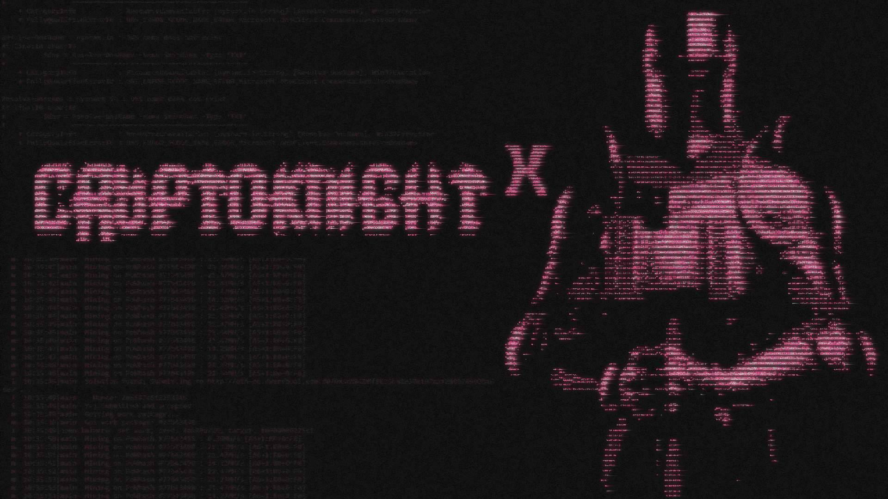

<!---banner by _surowo (discord)--->

<!---CKX--->

 
<h1 align="center">CryptoKnightX</h1>

 CryptoKnightX é um subshell encriptador de arquivos feito em bash script, o
objetivo deste software é manter sua privacidade e integridade de seus arquivos.

Este repositório é uma fork do projeto originado por Slackjeff.
<a href="https://notabug.org/slackjeff/knight" target="_blank">acesse aqui!</a>

<!---SUMARIO--->

<!---
 
<h2 align="center">Sumário</h2>
<a href="https://github.com/ghostkill73/CryptoKnightX?tab=readme-ov-file#dependências" target="_blank">1. Dependências</a>
 
<a href="https://github.com/ghostkill73/CryptoKnightX?tab=readme-ov-file#como-instalar" target="_blank">2. Como instalar?</a>
 
<a href="https://github.com/ghostkill73/CryptoKnightX?tab=readme-ov-file#como-utilizar" target="_blank">3. Como utilizar?</a>
 
<a href="https://github.com/ghostkill73/CryptoKnightX?tab=readme-ov-file#donate" target="_blank">4. Donate</a>
--->

<!---DEPENDENCIAS--->

 
<h2 align="center">Dependências</h2>

Dependências necessárias para utilizar o software:

<ul>
   <li><b><a href="https://www.gnu.org/software/tar/" target="_blank">GNU Tar</a> 1.30+</b></li>
   <li><b><a href="https://www.gnu.org/software/bash/" target="_blank">GNU Bash</a> 3+</b></li>
   <li><b><a href="https://gnupg.org/" target="_blank">gnupg</a> 2.2+</b></li>
</ul>

<b>OBS: as versões exigidas podem não corresponder com a realidade, o software está em fase de testes.
provavelmente dependências mais antigas irão funcionar corretamente.</b>

<!---COMO INSTALAR--->

 
<h2 align="center">Como instalar?</h2>

Utilize o <code>git</code> para instalar o repositório:

<pre>
git clone https://github.com/ghostkill73/CryptoKnightX
cd CryptoKnightX
chmod +x ckx
</pre>
 

usando o <code>wget</code>:

<pre><code>wget https://raw.githubusercontent.com/ghostkill73/CryptoKnightX/main/ckx && chmod +x ckx</code></pre>
 

usando o <code>curl</code>:

<pre><code>curl -L https://raw.githubusercontent.com/ghostkill73/CryptoKnightX/main/ckx >> ckx && chmod +x ckx</code></pre>

<!---COMO UTILIZAR--->

 
<h2 align="center">Como utilizar?</h2>

Para iniciar o software, execute o comando como usuário root:

<pre><code>sudo ./ckx --start</code></pre>

 

crie alguns arquivos e depois utilize o comando <code>exit</code> ou <code>quit</code>
para criptografar os arquivos e sair, será exigido uma senha para a respectiva encriptação,
não perca a senha de jeito algum!
   
Para acessar novamente será preciso digitar a senha que foi
digitada antes.

<h4>Comandos:</h4>
<pre>
-h, --help                 exibe esta mensagem e termina.
-v, --version              exibe a versão do software e termina.
-l, --license              exibe a licença do software e termina.
-s, --start                inicia o software.
-gpgconf, --enc-config     opção para configurar a criptografia no
                           modo questionário.   
</pre>

<h4>configurando o gpg:</h4>

<pre><code>sudo ./ckx -gpgcongf</code></pre>

Esse comando vai facilitar o processo de configuração da criptografia
simétrica do gpg.

<!---DONATE--->

 
<h2 align="center">Donate</h2>

bitcoin: bc1qq77c3w5l97da0pjn6d4dx9zueys29p799q7heq

