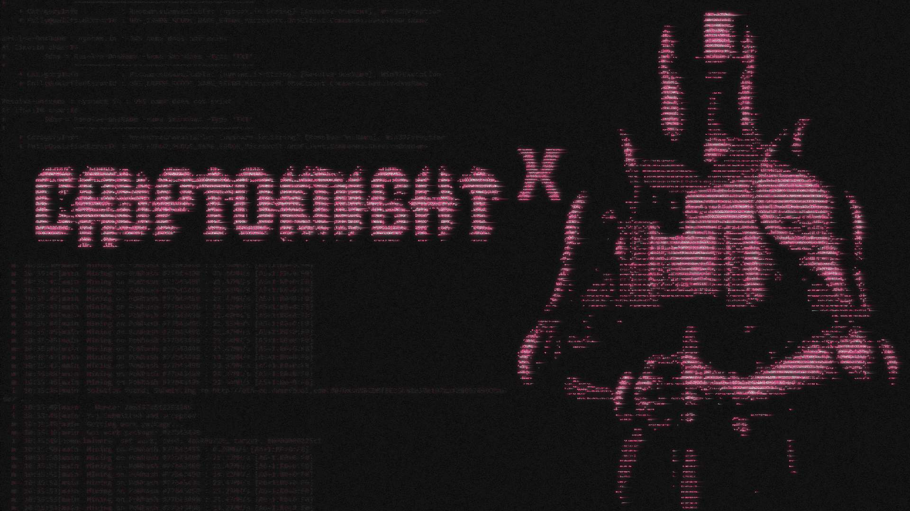

<!---banner by _surowo (discord)--->

<!---CKX--->

 
<h1 align="center">CryptoKnightX</h1>

CryptoKnightX é uma ferramenta CLI para criptografar arquivos utilizando GnuPG.

Mantenha a segurança e privacidade de seus arquivos importantes com simplicidade em seu terminal.

O CKX é um fork do projeto Knight,
<a href="https://notabug.org/slackjeff/knight" target="_blank">acesse aqui!</a>

<!---DEPENDENCIAS--->

 
<h2 align="center">Dependências</h2>

Dependências necessárias para utilizar o software:

<ul>
   <li><b><a href="https://www.gnu.org/software/tar/" target="_blank">GNU Tar</a> 1.30+</b></li>
   <li><b><a href="https://www.gnu.org/software/bash/" target="_blank">GNU Bash</a> 3+</b></li>
   <li><b><a href="https://gnupg.org/" target="_blank">gnupg</a> 2.2+</b></li>
</ul>

<b>OBS: as versões exigidas podem não corresponder com a realidade, o software está em fase de testes.
provavelmente dependências mais antigas irão funcionar corretamente.</b>

<!---INSTALAÇÃO--->

 
<h2 align="center">Como instalar?</h2>

Use um dos comandos logo abaixo para instalar o CKX:

<code>git</code>:

<pre>git clone https://github.com/ghostkill73/CryptoKnightX && cd CryptoKnightX && chmod +x ckx</pre>
 

<code>wget</code>:

<pre><code>wget https://raw.githubusercontent.com/ghostkill73/CryptoKnightX/main/ckx && chmod +x ckx</code></pre>
 

<code>curl</code>:

<pre><code>curl -L https://raw.githubusercontent.com/ghostkill73/CryptoKnightX/main/ckx > ckx && chmod +x ckx</code></pre>
 

<!---TODO--->

<h2 align="center">TO-DO</h2>

* [ ] Documentação
* [ ] Opção para configurações gerais
* [ ] Interface mais intuitiva e informativa

<!---DONATE--->

 

<h2>Donate</h2>

bitcoin: bc1qq77c3w5l97da0pjn6d4dx9zueys29p799q7heq

